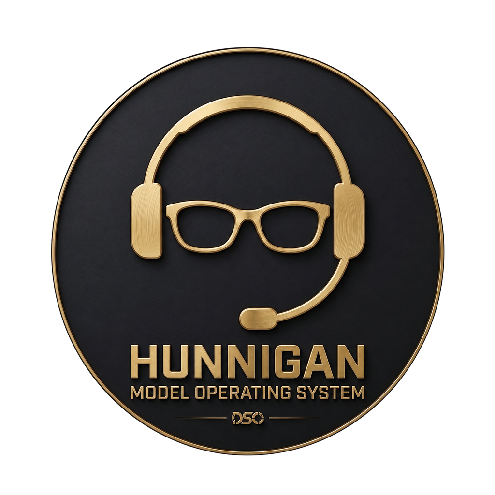
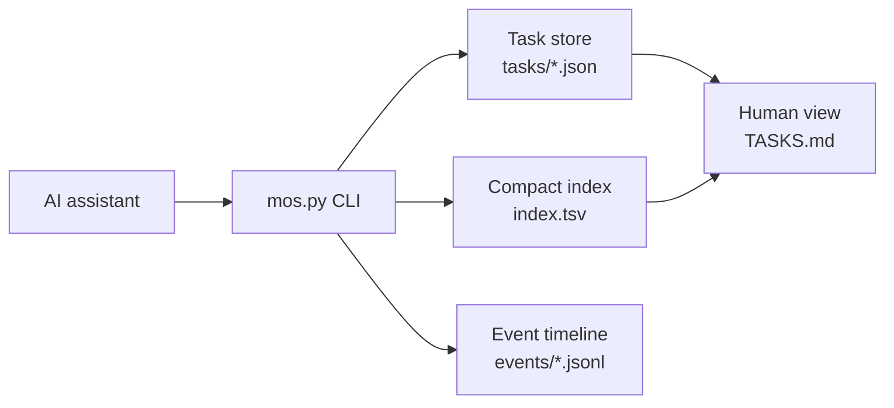

<div align="center">



### Your personal mission support operator.

A local-first **Model Operating System** for coordinating agents, memory, tools, context, and personal missions.


</div>

---

## Mission briefing

HUNNIGAN is a portable operating layer for people managing many asynchronous workstreams with AI assistants. It gives agents a small, dependable view of current work while preserving a durable history outside the model context window.

The result: less context reloading, cleaner handoffs, deterministic state changes, and a human-readable source of truth.

> **H.U.N.N.I.G.A.N.** — **H**ub for **U**nified **N**otes, **N**avigation, **I**ntelligence, **G**oals, **A**ctions, and **N**otifications.

## Why HUNNIGAN?

| Capability | What it provides |
| --- | --- |
| **Bounded context** | Agents retrieve current work, one task, or one reporting period without loading the entire workspace. |
| **Durable memory** | Compact task records and append-only events survive across sessions and models. |
| **Deterministic operations** | A dependency-free CLI owns every state mutation and regenerates human-facing views. |
| **Model portability** | Plain files and controlled English keep the system usable across assistants. |
| **Private by default** | Personal runtime state stays local and is excluded from Git. |
| **Human visibility** | Generated Markdown makes the live system easy to inspect offline. |

## System architecture



Canonical runtime data lives under `.mos/`:

```text
.mos/
├── config.json
├── index.tsv
├── tasks/
│   └── <task-id>.json
└── events/
    └── YYYY-MM.jsonl

TASKS.md                 # generated human view
```

The reusable framework contains `mos.py`, `AGENTS.md`, JSON schemas, tests, prompts, and documentation. Private runtime data and generated views are excluded through `.gitignore`.

## Quick start

**Requirements:** Python 3.10 or later. No third-party runtime packages.

```sh
python3 mos.py init

python3 mos.py add \
  --id first-task \
  --title "First task" \
  --next "Define the next action"

python3 mos.py list
```

Configure timezone and workdays in `.mos/config.json` after initialization.

## Command console

| Command | Purpose |
| --- | --- |
| `python3 mos.py list` | Show compact current work ranked for action. |
| `python3 mos.py show <task-id>` | Load one bounded task restart capsule. |
| `python3 mos.py add ...` | Create a task and its first event. |
| `python3 mos.py update <task-id> ...` | Apply a compact state delta. |
| `python3 mos.py complete <task-id> ...` | Complete a task and preserve the outcome. |
| `python3 mos.py event ...` | Record meaningful activity without changing task state. |
| `python3 mos.py context day\|week\|month\|year` | Build a bounded period report. |
| `python3 mos.py stats` | Measure context and storage sizes. |
| `python3 mos.py render` | Regenerate the index and human task view. |
| `python3 mos.py verify` | Validate canonical task and event integrity. |

Run `python3 mos.py <command> --help` for the complete command surface.

## Agent contract

Give an assistant [`AGENTS.md`](AGENTS.md), or configure the workspace to load it automatically. The contract keeps agent behavior predictable:

1. Use `mos.py` for reads and mutations.
2. Inspect one task before changing it.
3. Retrieve bounded day, week, month, or year context for reports.
4. Preserve exact supplied facts and leave unknown values unknown.
5. Keep owner-actionable work separate from work waiting on others.
6. Never edit generated `TASKS.md` directly.

## Privacy by default

The public framework and private runtime are deliberately separated.

**Safe to publish:** CLI code, schemas, tests, prompts, and reusable documentation.

**Keep private:** `.mos/`, generated task views, credentials, customer data, internal URLs, and real activity history.

Public examples should always use synthetic data.

## Verification

```sh
python3 -m unittest discover -s tests -v
python3 mos.py verify
```

Verification checks task schemas, IDs, lifecycle values, duplicate task/reference/event IDs, JSONL parsing, and event-to-task integrity.

## License

HUNNIGAN is available under the [MIT License](LICENSE).

## Fan-project disclaimer

HUNNIGAN is a fan-inspired personal and portfolio project. It is not affiliated with, endorsed by, or sponsored by Capcom. *Resident Evil* and related names and characters are the property of their respective owners.
